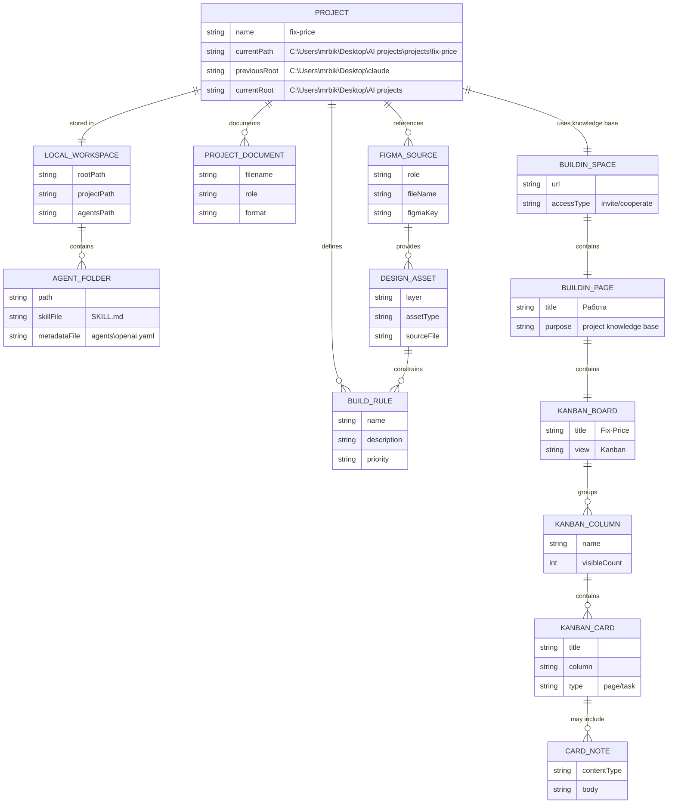
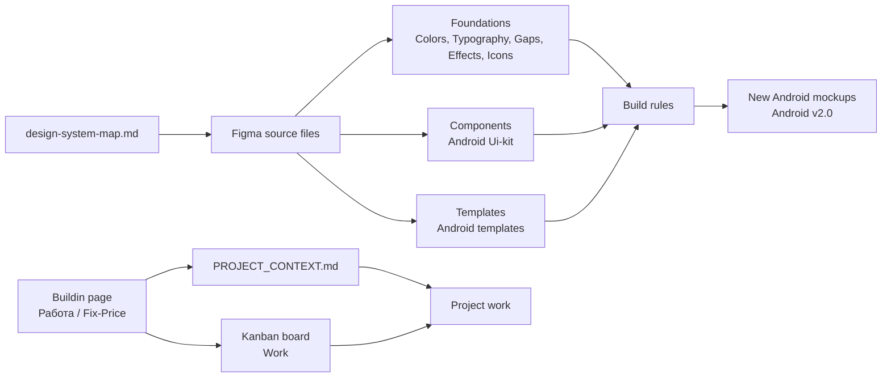
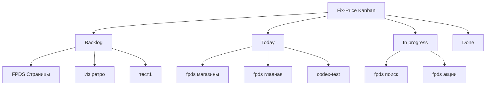
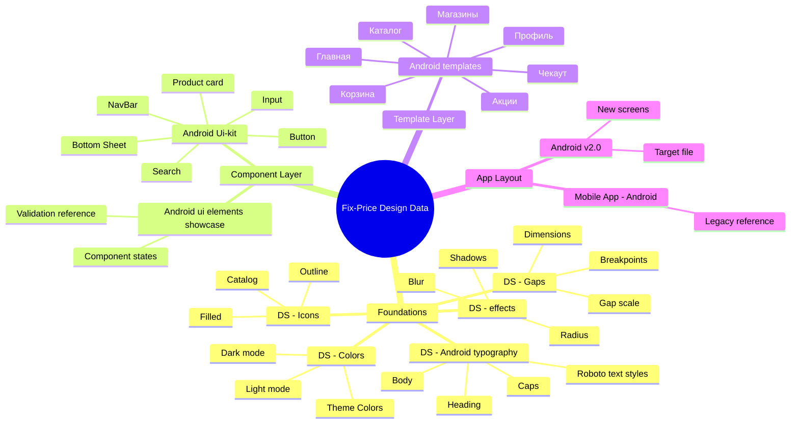

# Fix-Price Data Model

Визуализированная модель данных проекта Fix-Price. Использовать как карту сущностей для базы знаний, Buildin-канбана и дизайн-системных источников.

Кликабельная версия графа: [`data-model-graph.html`](data-model-graph.html).

## Scope

Модель описывает не продуктовую backend-БД, а рабочие данные проекта:

- локальный проект и его документацию;
- внешнюю базу знаний Buildin;
- канбан Fix-Price;
- задачи и страницы;
- источники дизайн-системы в Figma;
- правила сборки Android-макетов.

## Entity Relationship Model

## Knowledge Flow

## Kanban Model

## Design Source Taxonomy

## Current Seed Data

| Entity | Value | Notes |
| --- | --- | --- |
| Project | `fix-price` | Current local project |
| Local project path | `C:\Users\mrbik\Desktop\AI projects\projects\fix-price` | Current source of local knowledge files |
| Buildin URL | `https://buildin.ai/5d857221-669e-480d-bc9e-8261f9baad5a` | External knowledge base |
| Buildin page | `Работа` | Contains Fix-Price kanban |
| Board | `Fix-Price` | Kanban view under `Work` |
| Column | `Backlog` | Contains `тест1` |
| Column | `Today` | Contains `codex-test` |
| Test card | `codex-test` | Has lorem ipsum in description |
| Test page | `тест1` | Created in Backlog |

## Cardinality Rules

| Rule | Meaning |
| --- | --- |
| One project has one current local workspace | The active path is fixed in `PROJECT_CONTEXT.md` and `design-system-map.md`. |
| One project can reference many Figma source files | Design data is split across foundation, component, template, and app files. |
| One Buildin page can contain one or more project boards | Current known board is Fix-Price. |
| One kanban board contains many columns | Known columns include Backlog, Today, In progress, Done. |
| One kanban column contains many cards/pages | Cards represent project tasks or knowledge pages. |
| One design source provides many design assets | Assets become constraints for build rules and new mockups. |

## Maintenance Rules

- When a new Buildin card/page is created, add it to `Current Seed Data` if it becomes meaningful project context.
- When a new Figma file becomes a source of truth, add it to `design-system-map.md` first, then reflect it here.
- Keep this model conceptual. Product API schemas, database tables, or analytics events should get separate models if they appear later.
